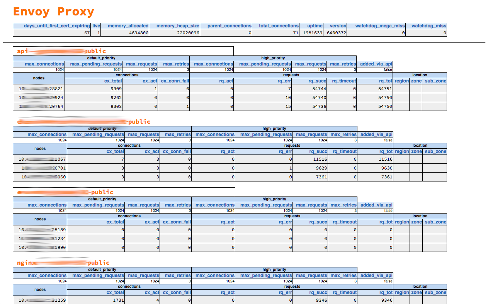

Envoy UI
========

A simple UI for the CNCF's [Envoy proxy](https://www.envoyproxy.io/) that
replicates some of the functionality of the HAproxy stats page. Intended to
talk to a single instance of the proxy.

Fetches statistics from `/clusters` and `/stats` on the Envoy node and renders
a single page with a more human-readable view of the statistics. Best used for
instances that are gateway nodes or Internet-facing headends. Each view is a
snapshot in time and does not auto-update.

Sample dashboard page for a proxy instance:


Installation
------------

You may either use the pre-built [Docker
image](https://hub.docker.com/r/gonitro/envoy-ui/) or build the binaries
yourself natively with [Crystal](https://crystal-lang.org). It has been
tested on Linux and macOS.

```
$ crystal build --release envoy-ui.cr
$ ./envoy-ui
```

To build an image locally and run a container
```
$ docker build -t envoy-ui .
$ docker run envoy-ui
```

Configuration
-------------

If you are running Envoy UI on the command line you can configure it with
CLI flags:
```
$ ./envoy-ui --help
Usage: envoy-ui [arguments]
    -h HOSTNAME, --host=HOSTNAME     Envoy proxy hostname (127.0.0.1)
    -p PORT, --port=PORT             Envoy proxy port (9901)
    -l PORT, --listen-port=PORT      Port to listen on (8080)
    --help                           Show this help
```

If you are running it in the Docker container, you may configure it with
environment variables:

 * `ENVOY_UI_HOST`: Envoy proxy hostname
 * `ENVOY_UI_PORT`: Envoy proxy port
 * `ENVOY_UI_LISTEN_PORT`: Port to listen on

Contributing
------------

Contributions are more than welcome. Bug reports with specific reproduction
steps are great. If you have a code contribution you'd like to make, open a
pull request with suggested code.

Pull requests should:

 * Clearly state their intent in the title
 * Have a description that explains the need for the changes
 * Include tests!
 * Not break the public API

Ping us to let us know you're working on it by opening a GitHub Issue on the
project.

Copyright (c) 2018 Nitro Software
